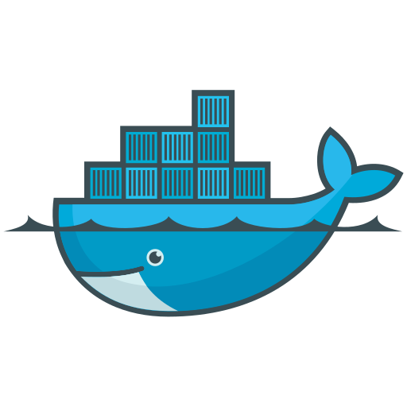

# Docker Notebook



# Section 1: Introduction

# Section 2:  Docker overview

---

## 2.1 What is Docker?

---

“Docker is an open-source platform for developer, shipping, and running applications in isolated environment called containers”

Key concepts: 

> **Containerization**: A lightweight form of virtualization
**Docker Engine**: The runtime that allow you to build and run container
**Docker Image**: A read-only template used to create container
**Docker Container**: A runnable instance of a Docker Image
**Docker Hub**: A cloud-based registry for storing and sharing Docker Image
> 

## 2.2 Why Docker?

---

**Traditional Challenges**: “It works on my machine!”, dependency conflicts, environment mismatches, slow setups.

**Docker’s solution**: 

- Packages apps with all dependencies(code, run time, tools)
- Lightweight and fast compared to VMs

**Benefits:** 

- Consistency (Tính thống nhất): Chạy app ở các môi trường dev, test, prod như nhay
- Efficiency (Tính hiệu quả): Nhẹ, nhanh hơn VM
- Isolation (Tính cô lập): Các container được cô lập với nhau và với host, tăng cường bảo mật và giảm thiểu xung đột
- Portability (Tính di động):  Hoạt động trên bất kỳ platform nào hỗ trợ docker
- Scalability : Đơn giản hóa quá trình scale-out
- Versioning : Hỗ trợ image version, dễ dàng update và rollbacks

## 2.3 So sánh Docker và máy ảo

---


Trong các container không chứa OS.


# Section 3: Cài đặt Docker và môi trường

---

## 3.1 Cài Docker trên Windows:

---

## 3.2 Cài Docker trên Ubuntu

---

```bash
$ curl -fsSL http://get.docker.com -o getdocker.sh
$ sudo sh./get-docker.sh --dry-run
```

## 3.3 Cài Powershell ( Khác Window Powershell)

---

**Windows PowerShell** là tên gọi của phiên bản PowerShelle **cũ và độc quyền** của Microsoft, còn **PowerShell** (hiện tại) là tên gọi của phiên bản **hiện đại, đa nền tảng, và mã nguồn mở**.
[https://learn.microsoft.com/en-us/powershell/scripting/install/install-powershell-on-windows?view=powershell-7.5#winget](https://learn.microsoft.com/en-us/powershell/scripting/install/install-powershell-on-windows?view=powershell-7.5#winget)

## 3.4 Cài WSL + distro

---

**Bước 1: Kích hoạt WSL 2**

1. Mở PowerShell với quyền Administrator
2. Chạy lệnh sau để kích hoạt WSL:
`dism.exe /online /enable-feature /featurename:Microsoft-Windows-Subsystem-Linux /all /norestart`
3. Chạy lệnh sau để kích hoạt Virtual Machine Platform:
`dism.exe /online /enable-feature /featurename:VirtualMachinePlatform /all /norestart`
4. Khởi động lại máy tính
5. Mở lại PowerShell với quyền Administrator
6. Đặt WSL 2 làm phiên bản mặc định:
`wsl --set-default-version 2`

**Bước 2: Cài đặt bản phân phối Linux**
(Có thể dùng command line hoặc Microsoft Store)

1. Mở PowerShell với quyền Administrator
2. Xem danh sách các bản phân phối Linux có sẵn: `wsl --list --online`
3. Cài đặt bản phân phối bạn chọn: `wsl --install -d Ubuntu` (dựa vào tên hiển thị ở bước trước)
4. Đặt tên người dùng và tạo mật khẩu (nhớ để lần sau còn dùng)
5. Gõ `exit` để thoát khỏi terminal trong WSL

## 3.5 Cài Docker Desktop trên Windows

---

**Step 3: Cài đặt Docker**
Tải Docker Desktop tại [https://docs.docker.com/desktop/setup/install/windows-install/](https://docs.docker.com/desktop/setup/install/windows-install/)
Cài đặt file vừa tải về và khởi động lại máy tính

**Step 4: Cấu hình Docker Desktop**
Mở Docker Desktop
Vào Settings > General > Tick vào "Start Docker Desktop when you sign in"
Đảm bảo WSL được dùng làm backend: Settings > Resources > WSL Integration > Tick "Enable"

**Step 5: Kiểm tra cài đặt**
Mở PowerShell
Chạy lệnh: `docker --version`
Chạy thử: `docker run hello-world`
Mở Docker Desktop để xem containers và images

**Lưu ý:** Docker Desktop phải đang chạy thì mới làm việc với Docker được

# Section 4: Docker architecture - Kiến trúc Docker

---

Docker sử dụng kiến trúc client-server. Docker client giao tiếp với Docker daemon, phần thực hiện các công việc nặng nhọc như build, chạy và phân phối các Docker container của bạn. Docker client và daemon có thể chạy trên cùng một hệ thống, hoặc bạn có thể kết nối Docker client với một Docker daemon từ xa. Docker client và daemon giao tiếp với nhau thông qua REST API, qua UNIX sockets hoặc giao diện mạng. Một Docker client khác là Docker Compose, cho phép bạn làm việc với các ứng dụng bao gồm một tập hợp các container.


- Docker Engine: core runtime giúp việc build, run and manage container = Docker Daemon + Docker CLI + API
- Docker CLI: Là 1 giao diện trên terminal tương tác với Docker
- Docker Daemon: Background service giúp quản lý container, images, networks, and volumes
- Docker Images:  Mẫu chỉ có thể đọc, sử dụng nó để tạo container
- Docker Container: Được tạo ra dừ Docker Images
- Dockerfile: text file hướng dẫn build Docker Image
- Docker Hub/ Docker Registry:  lưu và chia sẻ docker image trên cloud
- Docker Compose: Tool giúp định nghĩa và chạy ứng dụng nhiều container, sử dụng YAML file
- Docker Volumes: Lưu trữ lâu dài cho container
- Docker network: Kết nối giữa các Docker cx như giao tiếp với bên ngoài
- Docker Desktop UI: Giao diện đồ họa giúp quản lý Docker. Tương tác với daemon phía sau


## 4.1 Docker CLI

---

- Thường sẽ làm việc qua CLI
- User sẽ nhập lệnh trên CLI
- Các lệnh này sẽ được chuyển thành request và request được gửi đến Docker Daemon và đợi response

```bash
$ docker run
$ docker build
$ docker pull
```

## 4.2 Docker Host

---

Docker host:

- Cung cấp một môi trường hoàn chỉnh để thực thi và chạy ứng dụng. Nó bao gồm Docker daemon, Images, Container và Volumnes
- Là máy vật lý hoặc máy ảo mà Docker Daemon đang chạy trên đó

Docker Daemon chịu trách nhiệm chạy containers, build images và xử lý các hoạt động khác của Docker mà chúng ta gọi từ CLI

## 4.3 Docker Registry

---

Docker Registry:

- Nơi lưu trữ và chia sẻ Docker Image, ví dụ Docker Hub
- Cho phép push image sau khi build và pull image về để chạy container

Một số loại Docker registry:

- Public
- Private
- Từ triển khai Registry

# Section 5: Docker commands and Docker container

---

## 5.1 Docker Container

---

- Là running instance của Docker Image

> Docker Image giống như bản thiết kế nhà- chứa đầy thiết kế nhà và cách xây dựng nhà. Nhưng bản thân nó không phải ngôi nhà
Docker Container giống như một ngôi nhà thực tế - được cây dựng từ bản thiết kế
- Từ 1 bản thiết kế → tạo ra nhiều ngôi nhà
> 

→ Từ 1 image → có thể tạo nhiều container

- Để chạy một  container từ docker image:

```bash
$ docker run <image_name>
$ docker run --name <container_name> <image_name>
```

Note: image_name sẽ bao gồm cả image_tag. 

## 5.2 Demo Docker container - hello world

---

```bash
PowerShell 7.5.4
PS C:\Users\Admin> docker --version
Docker version 29.1.2, build 890dcca
PS C:\Users\Admin> docker run hello-world
Unable to find image 'hello-world:latest' locally
latest: Pulling from library/hello-world
17eec7bbc9d7: Pull complete
ea52d2000f90: Download complete
Digest: sha256:d4aaab6242e0cace87e2ec17a2ed3d779d18fbfd03042ea58f2995626396a274
Status: Downloaded newer image for hello-world:latest

Hello from Docker!
This message shows that your installation appears to be working correctly.

To generate this message, Docker took the following steps:
 1. The Docker client contacted the Docker daemon.
 2. The Docker daemon pulled the "hello-world" image from the Docker Hub.
    (amd64)
 3. The Docker daemon created a new container from that image which runs the
    executable that produces the output you are currently reading.
 4. The Docker daemon streamed that output to the Docker client, which sent it
    to your terminal.

To try something more ambitious, you can run an Ubuntu container with:
 $ docker run -it ubuntu bash

Share images, automate workflows, and more with a free Docker ID:
 https://hub.docker.com/

For more examples and ideas, visit:
 https://docs.docker.com/get-started/
```

## 5.3 Demo Docker container - ubuntu

---

```bash
PS C:\Users\Admin> docker run -it ubuntu bash
Unable to find image 'ubuntu:latest' locally
latest: Pulling from library/ubuntu
20043066d3d5: Pull complete
06808451f0d6: Download complete
Digest: sha256:c35e29c9450151419d9448b0fd75374fec4fff364a27f176fb458d472dfc9e54
Status: Downloaded newer image for ubuntu:latest
root@8978366fd784:/# whoami
root
root@8978366fd784:/# ls
bin   dev  home  lib64  mnt  proc  run   srv  tmp  var
boot  etc  lib   media  opt  root  sbin  sys  usr
```

## 5.4 Liệt kê các container:

---

- Tất cả container đang chạy:

```bash
$ docker ps
```

- Tất cả container:

```bash
$ docker ps -a
```

## 5.5 Xóa container

---

- Container đã dừng:

```bash
$ doker rm <container_id_or_name>
```

- Xóa bắt buộc

```bash
$ docker rm -f <container_id_or_name>
```

## 5.6 Start, Stop container

---

 

```bash
$ docker stop <container_id_or_name>
$ docker start <container_id_or_name>
$ docker restart <container_id_or_name> 
```

## 5.7 Kiểm tra Docker container với inspect

---

```bash
$ docker inspect <container_id_or_name> 
```

## 5.8 Các chế độ chạy container

---

- Chạy ngầm

```bash
$ docker run -d <image_name>   #-d: detached
```

- Chạy và tương tác

```bash
$ docker run -it <image_name> /bin/bash
```

## 5.9 Port Mapping

---

```bash
$ docker run -p <host_port>:<container_port> <image_name>
```

Ví dụ:  

```bash
$ docker run -p 8080:80 nginx
```

- -p 8080:80: ánh xạ cổng 8080 trên máy host với cổng 80 container

## 5.10 Working with Logs

---

- Xem log của container đến thời điểm hiện tại

```bash
$ docker logs <container_id_or_name>
```

- Xem log real-time, xem log liên tục khi container đang chạy

```bash
$ docker logs -f <container_id_or_name>
```

## 5.11 Xóa nhiều container một lúc

---

```bash
$ docker container prune #co xac nhan
$ docker container prune -f #force remove
```

## 5.12 Cách chạy một lệnh bất kỳ trong Docker container

---

```bash
docker exec -it <container_id_or_name> <commands>
```

## 5.13 Chạy Docker với restart policy <hơi khó>

---

- **Restart policy: Giúp docker tự động khở động lại trong các tính huống lỗi, crash, hoặc khi Docker daemon khởi động lại. Đảm bảo ứng dụng có độ sẵn sàng cao**
- **Cách thiết lập: sử dụng flag —restart trong câu lệnh docker run. VD: docker run —restart always**
- **Khi nào cần dùng:**
    - **Production environment tự động phục hồi khi container crash**
    - **Long-running service: database, web server, api services**
    - **System reboot: container tự khởi động lại sau khi server restart**
    - **Unexpected: Xử lý lỗi không mong muốn**
- **Các option liên quan đến restart:**
    - **no (default): Container không tự khởi động lại**
    - **always: Container luôn khởi động lại khi dừng. Nếu chúng ta chủ động dừng container qua lệnh docker stop thù container sẽ khởi động lại khi Docker daemon khởi động lại**
    - **on-failure[:max-retries]:**
        - **Chỉ khởi động lại khi container thoát với lỗi (exit code khác 0).**
        - Có thể giới hạn số lần retry, ví dụ: on-failure:5
        - Docker daemon restart: container không tự khởi động
    - **unless-stopped: Giống always nhưng không khởi động lại nếu container đã được dùng thủ công với docker stop**

## 5.14 Overview

---

```bash
$ docker run [option] image [command] [arg...]
```

- option:
    - -d
    - -it
    - —name <container_name>
    - -p host_port:container_port
    - -v host_path:container_path

# Section 6: Docker image

---

## 6.1 Tổng quan về Docker Image

---

- Docker Image là một **tập hợp các lớp (layers) chỉ đọc (read-only)** chứa tất cả các thành phần cần thiết để chạy một ứng dụng, bao gồm: Mã nguồn (Source code), môi trường chạy (runtime environment), các công cụ thiết yếu (essential tools), thư viện (libs) và các cài đặt cấu hình (configuration settings). Image là bản thiết kế để tạo ra Container
    - Layer:
        - Image được xây dựng từ một chuỗi các lớp chỉ đọc (read-only layers). Mỗi lớp đại diện cho một thao tác hoặc thay đổi trong Dockerfile (ví dụ: thêm một file, cài đặt một thư viện, chạy một lệnh)
        - **Đặc điểm:** Các lớp này được xếp chồng lên nhau. Khi một Container được chạy từ Image, một **lớp có thể ghi (writable layer)** sẽ được thêm vào trên cùng. Mọi thay đổi trong Container (như ghi file, sửa file) chỉ xảy ra trong lớp có thể ghi này, giúp Image gốc luôn giữ nguyên trạng (read-only)
        - **Lợi ích:** Cơ chế lớp giúp Docker tái sử dụng các lớp chung giữa nhiều Image. Điều này làm giảm kích thước của Image mới và tăng tốc độ triển khai (deployment).
    - Base Image:
        - **Định nghĩa:** Là lớp đầu tiên và nền tảng của một Image. Nó là Image không có Parent Image (Image cha).
        - **Đặc điểm:** Base Image thường chứa một hệ điều hành cơ bản (như Alpine, Ubuntu, Debian) hoặc một môi trường runtime (như Node.js, Python). Nó là nơi bắt đầu cho quá trình xây dựng Image.
    - Parent Image
        - **Định nghĩa:** Là bất kỳ Image nào mà Image hiện tại được xây dựng dựa trên (tức là được tham chiếu trong lệnh `FROM` của Dockerfile).
        - **Mối quan hệ:** Ngoại trừ Base Image (không có Image cha), tất cả các Image khác đều là Parent Image của các Image tiếp theo trong chuỗi xây dựng.
        - **Ví dụ:** Nếu bạn xây dựng Image của mình dựa trên `node:18-alpine`, thì `node:18-alpine` là Parent Image của Image bạn đang tạo.
    - Image Tags
        - **Định nghĩa:** Là một cơ chế gắn nhãn văn bản cho Docker Image để phân biệt các phiên bản hoặc biến thể khác nhau của cùng một Image.
        - **Ví dụ:** Image `ubuntu` có thể có nhiều Tags như `ubuntu:latest` (phiên bản mới nhất), `ubuntu:22.04` (phiên bản cụ thể), hoặc `ubuntu:old-stable`.
        - **Sử dụng:** Tag phổ biến nhất là `:latest`. Nếu bạn không chỉ định Tag khi kéo Image, Docker sẽ mặc định sử dụng `:latest`
        

## 6.2 Pulling Images từ Docker Hub

---

```bash
$ docker pull <image_name>:<tag>
```

vd: docker pull ubuntu:lastest

## 6.3 Liệt kê các Docker Image

---

```bash
$ docker images
$ docker images ls
```

Output: 

```bash
PS C:\Users\Admin> docker images
                                             i Info →   U  In Use
IMAGE           ID             DISK USAGE   CONTENT SIZE   EXTRA
nginx:latest    fb01117203ff        228MB         62.6MB    U
ubuntu:latest   c35e29c94501        119MB         31.7MB    U
```

## 6.4 Xóa Docker Images

---

```bash
$ docker rmi <image_name>:<tags>
$ docker rmi <image_id>
```

## 6.5 Inspect Images and images tagging

---

```bash
docker inspect <images_name>:<tag>
```

Hiển thị thông tin chi  tiết dạng JSON về một DOcker Image, bao gồm cấu hình, môi trường, lệnh khởi động, các lớp, kích thước, kiến trúc hệ điều hành và thời điểm tạo images.

- Upload image lên tk của mình:
    - docker tag myimage:v1 my-dockerhub-username/myimage:v1

## 6.6 Cleaning up

- Remove all unused resuource (container, networks, images):

```bash
$ docker system prune 
$ docker system prune -f
```

# Section 7: Dockerfile and Build Docker Images

---

## 7.1 Overview

---

Dockerfile là file văn bản chứa các intruction để tự động hóa quá trình tạo docker image. Nó định nghĩa môi trường, dependencies và cách chúng ta chạy ứng dụng

Cấu trúc cơ bản:

- Mỗi dòng là 1 instruction
- mỗi instruction tạo ra một layer trong image
- Dockerfile thường bắt đầu bằng FROM để chỉ định base image

## 7.2 Docker instruction

---

- DOcker instruction là các chỉ thị lệnh được viết tring file Dockerfile để hướng dẫn DOcker cách xây dựng một image. Mỗi trường instruction là một từ khóa viết in hoa (FROM, COPY, RUN, CMD,…) vè thường đi kèm tham số


- LABEL: để gắn metadata cho image. Thêm thông tin mô tả về image như version, ai tạo ra, mục địch. Giúp việc tìm kiếm dễ hơn.
- ARG: khai báo biến. Định nghĩa biến chỉ dùng trong quá trình docker build. CHo phép truyền giá trị sau khi build bằng —build-arg. Sau khi build xong, container không thể truy cập biến ARG nữa
- ENV: Khai báo biến môi trường trong image. Biến này tồn tại cả trong quá trình build lẫn khi container chạy. Biến môi trường được khai báo bằng ENV có thể bị ghi đè khi chạy container bằng cách sử dụng còe -e hoặc —env trong lệnh docker run. có thể kiểm tra bằng docker inspect container_name_or_id
- COPY:  sao chép thư mục từ source → des
- ADD: copy+ tự động giải nén nếu là .tar .tar.gz, .tar.bz2,… Hỗ trợ URL, có thể tải file từ Internet
- CMD: Lệnh mặc định, có thể bị ghi đè.
    - Bị ghi đè nếu truyền lệnh mới khi docker run
- ENTRYPOINT - Lệnh cố định, khó bị ghi đè
    - Xác định lệnh chính và cố định mà container luôn chạy
    - Nếu truyền đối số khi chạy container, nó sẽ gắn sau lệnh ENTRYPOINT
- EXPOSE: khai báo port mà container sử dụng để giao tiếp với bên ngoài
    - Tài liệu hóa cổng trong Image, giúp người khác biết ứng dụng được lắng nghe ở đâu
    - Không có tác dụng mở cổng thực sự - để ứng dụng khả dụng từ bên ngoài, phải dùng -p khi chạy container (chính là port mapping)

## 7.3 Lệnh để build Docker Image

---

```bash
$ docker build -t <image_name>:<image_tag> .
```

```bash
$ docker build -f <path_to_Dockerfile> -t <image_name>:<image_tag> <build_context_path>
```

## 7.4 Thực hành build Docker file

```bash
#Base image sẽ sử dụng để tạo Docker image mới
FROM ubuntu:latest

#Đây là comment
#WORKDIR - giúp chúng ta thiết lập thư mục làm việc trong môi trượng tạo Dockerimage
# /app sẽ là thư mục làm việc của mình trong môi trường tạo docker image - coi như đứng trên thư mục này
WORKDIR /app

COPY script.sh .

#Set up câu lệnh mặc định khi chạy Docker container từ docker image được tạo từ DOcker file này
# run: bash script.sh
CMD ["bash", "script.sh"]
```

# 7.5 Layer

- Khi Docker build images, nó xây dựng theo kiểu layered architecture
- Mỗi dòng của instruction tạo thành một layer mới trong Docker image chỉ với sự thay đổi so với layer trước đó.
- Việc hiểu rõ các instruction giúp bạn viết Dockerfile tối ưu, giảm kích thước image, tăng hiệu suất buil và deploy
- Docker sử dụng layered architecture này để tái sử dụng cache và giảm dung lượng
- Kji build lại image, Docker sẽ dùng lại layer cũ nếu nội dung không đổi → giúp build nhanh hơn
- Mẹo tối ưu Dockerfile
    - Sắp xếp các instruction ít thay đổi trước, để tận dụng cache
    - Gộp nhiều RUN lại bằng && để giảm số layer

## 7.6 Tối ưu build Docker image với multi stage build

---

**Multi-stage build** là kỹ thuật sử dụng nhiều giai đoạn trong 1 docker file để tối ưu kích thước image cuối cùng

**Vấn đề cần giải quyết:**

- Image size  lớn: chứa các dependencies không cần thiết cho runtime
- Security risks: Nhiều tools và packages không sử dụng
- Deploy chậm: Image lớn làm tăng thời gian pull/push

# Section 8: Docker Storage and Mounting

---

## 8.1 Docker storage overview

---


- lưu trữ lâu dài
- Chia sẻ dữ liệu giữa các container
- backup và restore dữ liệu

## 8.2 Docker volumes

---

Ba kiểu Mount trong docker:

- Bind Mount:
    - Mount trực tiếp thư mục host vào container
    - Đường dẫn tuyệt đối trên host
- Volume  Mount
    - Docker quản lý storage
    - Lưu trữ tròn /var/lib/docker/volumes/
- tmpfs Mount
    - Lưu trữ trong Memory
    - Tạm thời, mất khi container sập

Một số commands liên quan đến volume mount

```bash
#create volume
$ docker volume create my-ubuntu-data
#liít
$ docker volume is
#in4
$ docker volume inspect my-ubuntu-data
#delete
$ docker volume rm my-ubuntu-data
```

Cách thực hiên molume mount hoặc bind mount

Volume mount

```bash
-v <volume_name>:<path_in_docker_container>
```

Bind mount

```bash
-v <absolute_path_in_host>:<path_in_docker_container>
```

# 8.3 Thực hành Bind mount

 

```bash
PS C:\Users\Admin\Desktop\my_folder> docker run -it -v C:\Users\Admin\Desktop\my_folder\my_data:/app  ubuntu:latest bash 
```

# 8.4 Thực hành Volume mount

# Section 9: Docker Networking

## 9.1 Docker network overview

---

Docker networking tạo ra một hệ thống mạng ảo để:

- Container giai tiếp với nhau
- Container kết nối ra Internet
- Host truy cập vào container
- Cô lập traffic giữa các application
- Docker cung cấp nhiều driver  mạng tùy vào nhau cầu sử dụng

```bash
$ docker network ls 
```

Output: 

```bash
PS C:\Users\Admin\Desktop\my_folder> docker network ls                 
NETWORK ID     NAME      DRIVER    SCOPE
acdc08e95b16   bridge    bridge    local
b79f8315b036   host      host      local
3d96a2173b96   none      null      local
PS C:\Users\Admin\Desktop\my_folder> 
```

# 9.2 Host network

---

- Container sử dụng trực tiếp network stack của host
- Không có network isolation
- Performance tốt nhất
- Port conflict có thể xảy ra (do nhiều container cùng sử dụng trực tiếp network stack của host)

Khi nào nên dùng host network

- Cần performance cao
- Network-intensive applications
- Monitoring tools
- Development/testing nhanh
- Note: Chỉ hoạt động đầy đủ trên Linux

## 9.3 Bridge network

---

## 9.4 Custom bridge network

---

- Để container có thể giao tiếp với nhau qua teen container

⇒ Dễ dàng hơn

- Tách biệt network cho các applications
- Kiểm soát tốt hơn về security và routing

```bash
$ docker network create --driver bridge my-network
```

# 9.5 Null network

---

- Container hoàn toàn isolated, không có network access
- Không giao tiếp với bất kỳ container nào, kể cả host
- Dùng trong sandbox, kiểm thử bảo mật

**Thực hành:**

```bash
$ docker network disconnect brige <container_id>
$ docker network connect none <container_id>
```

# Section 10: Docker Compose

---

## 10.1 Overview về Docker compose

---

- Là công cụ giúp định nghĩa và chạy nhiều container với cấu hình trong 1 file YAML duy nhất
- Dễ dàng quản lý các dịch vụ có phụ thuộc lẫn nhau (ví dụ: web + database)
- Thay vì chạy từng docker run riêng lẻ, chỉ cần docker compose up

## 10.2 Docker compose commands

---

- docker compose up: Chạy các container và hiển thị log ngay trên terminal
- docker compose up -d: Chạy các container ở detached mode
- docker compose up —build: ép build lại images trước khi chạy
- docker compose down: dừng và xóa container, network do Docker compose tạo ra
- docker compose stop: tạm dừng các container, không xóa gì cả
- docker compose restart:
- docker compose ps: Xem trạng thái các container đang chạy từ Compose

## 10.3 YAML file

---

Đặc điểm chính:

- Dễ đọc
- Hỗ trợ cmt
- Cú pháp đơn giản
- Đa dạng kiểu dữ liệu
- Tương thích

YAML file có đuôi là **.yaml** hoặc **.yml**

**Quy tắc quan trọng khi viết YAML file:**

- Chỉ sử dụng spaces, không dùng tabs
- Phải nhất quán số spaces trong cùng cấp độ
- Thường dùng 2 hoặc 4 spaces cho mỗi cấp

## 10.4 Các kiểu dữ liệu chính của YAML files

---

- Array/Sequence

```bash
fruit:
  - apple
  - banana
  - mango
  
fruit: [apple, banana, mango]
```

- Map/Object

```bash
person:
  name: Alice
  age: 25
  
person: {name: Alice, age: 25}
```

- String

```bash
name: Nam
city: Hanoi
country_1: "Viet Nam"
```

- Number
- null
- Boolean
    - true:
        - true
        - yes
        - on
    - false:
        - false
        - no
        - off

## 10.5 Minh họa

---


## 10.6 Thực hành viết YAML file

---

```bash
services:
  fastapi:
    build:
      context: .
      dockerfile: dockerfile
    ports: 
      - "8000:8000"
    depends_on:
      - db
    environment:
      - DATABASE_URL=postgresql://user:password@db:5432/mydb
  db:
    image: postgres:latest
    environment:
      - POSTGRES_USER=user
      - POSTGRES_PASSWORD=password
      - POSTGRES_DB=mydb
    ports:
      - "5432:5432"
```

# Section 11: Docker Swarm

---

## 11.1 Overview về Docker swarm

---

- Định nghĩa:
    - là một orchestration tool từ Docker
    - cho phép kết hợp nhiều máy Docker (host) thành một cụm duy nhất gọi là swarm
    - quản lý và phân phối container như một hệ thống phân tán
    - đảm bảo high availability và load balancing cho ứng dụng
- Kiến trúc Swarm cluster
    - manage node: Điều phối toàn bộ swarm, chịu trách nhiệm lên lịch, scaling, health check
    - worker node: thực thi container theo lệnh từ manage
    - node: bất kì host nào đã tham gia swarm, có thể là manage hoặc worker
- Tính năng chính của Docker swarm
    - tự động phân phối container
    - tự động scale out/in số lượng container
    - hỗ trợ rolling update cho các container
    - CLI đơn giản, tích hợp sẵn trong Docker

## 11.2 Docker Stack

---

- là lớp trừu tượng cao hơn của Docker swarm, giúp dễ dàng triển khai nhiều service cùng lúc bằng cách sử dụng cấu hình YAML, giống như docker compose, nhưng dùng cho Swarm mode.
- Nếu dùng nhiều service, Docker Stack đơn giản và dễ bảo trì hơn, vì:
    - dùng yaml file
    - ko tạo từng service bằng dòng lệnh
    - có thể dễ dàng scale/update toàn bộ stack
- Một số bước chính:
    - bật swarm mode: docker swarm init
    - deploy stack với docker compose yaml: docker stack deploy -c <path_of_docker_compose.yaml> <stack_name>
    - kiểm tra các stack: docker stack ls
    - kiểm tra các services trong một stack: docker stack service <stack name>
    - scale một service trong 1 stack: docker service scale <stack_service_name>:<number>
    - xóa stack: docker stack rm <stack_name>

# Section 12: Docker Registry

---

## 12.1 Tổng quan về Docker Registry

---

- To tag an existing image:

```bash
$ docker tag <source_image>:<tag> <target_image>:<target_tag>
```

- Pushing images to Docker Hub
    - log in vào docker hub:
    
    ```bash
    $ docker login -u username
    ```
    
    - Push image
    
    ```bash
    $ docker push my-dockerhub-username/myimage:v1
    ```
    

## 12.3 Lưu Docker image vào file .tar hoặc .tar.gz

---

- Lưu vào file .tar

```bash
$ docker save -o <file_name>.tar <image_name>:<image_tag>
```

- Load lại Docker image từ file .tar

```bash
$ docker load -i <file_name>.tar
```

- Lưu vào file .tar.gz

```bash
$ docker save <image_name>:<image_tag> | gzip > <file_name>.tar.gz
```

- Load lại từ .tar.gz

```bash
$ docker load < <file_name>.tar.gz
$ docker load -i <file_name>.tar.gz
```

# Section 13: Dev in Docker containers

---

## 13.1 Overview

---

## 13.2 Tips/tricks

---

- lưu các package  đã cài theo thứ tụ
- đảm bảo chỉ định version
- history > install_commands.txt

# Section 14: Tips and Tricks

---

## 14.1 set user root và user thường

## 14.2 tạo dockerfile có thay đổi user

```bash
FROM ubuntu:20.04

RUN apt update && apt install git -y 

#tạo user mơi và chuyển qua user đó

RUN useradd -m myuser
USER myuser

CMD ("bash")
```

End
